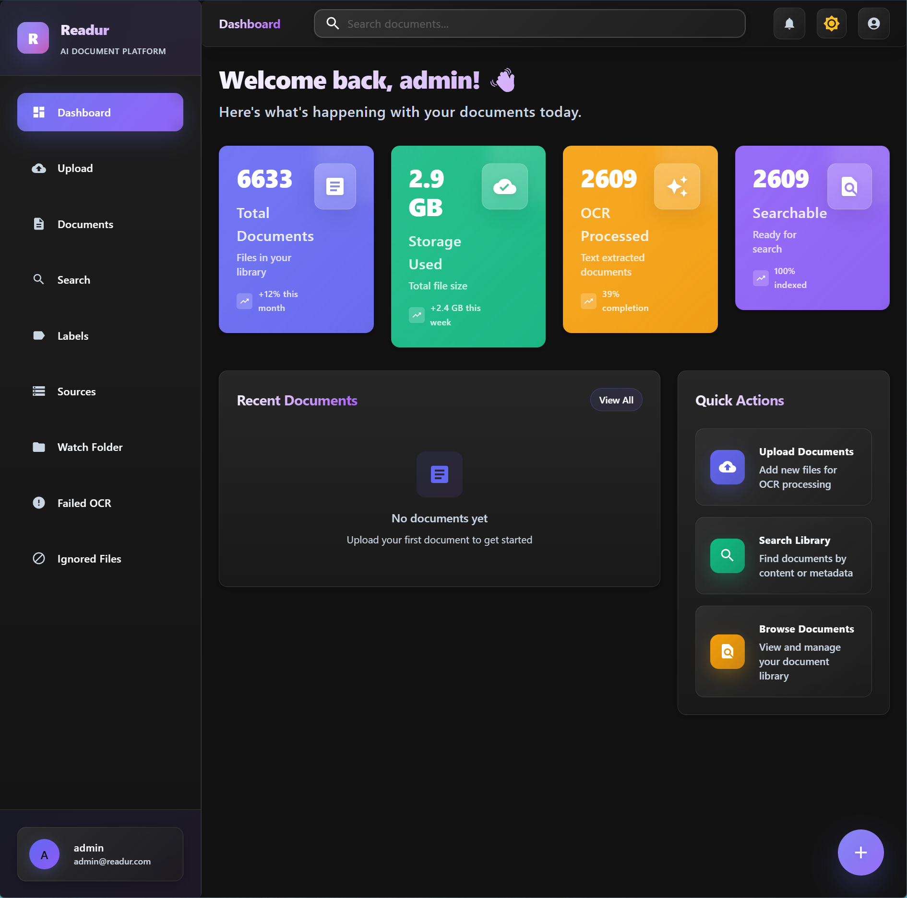
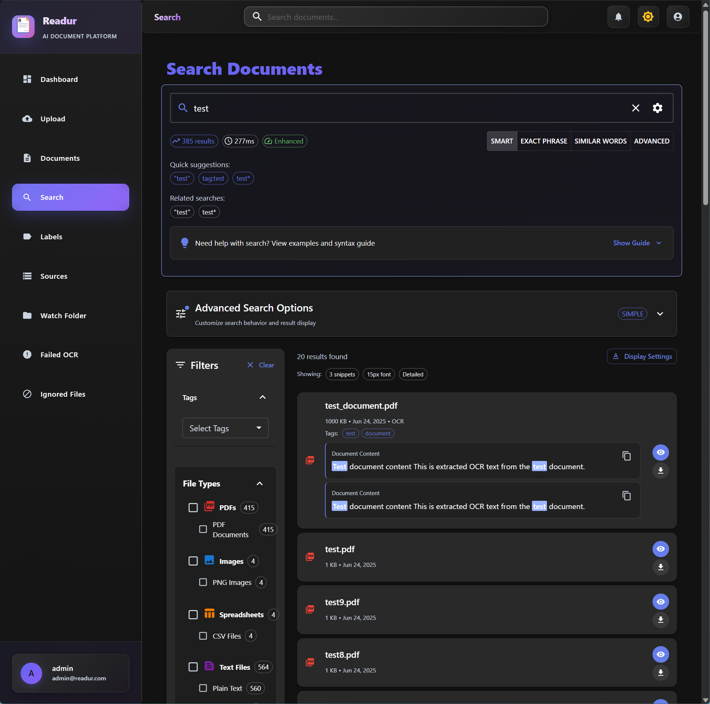

# Readur 📄

A powerful, modern document management system built with Rust and React. Readur provides intelligent document processing with OCR capabilities, full-text search, and a beautiful web interface designed for 2026 tech standards.




## ✨ Features

- 🔐 **Secure Authentication**: JWT-based user authentication with bcrypt password hashing + OIDC/SSO support
- 👥 **User Management**: Role-based access control with Admin and User roles
- 📤 **Smart File Upload**: Drag-and-drop support for PDF, images, text files, and Office documents
- 🔍 **Advanced OCR**: Automatic text extraction using Tesseract for searchable document content
- 🔎 **Powerful Search**: PostgreSQL full-text search with multiple modes (simple, phrase, fuzzy, boolean)
- 🔗 **Multi-Source Sync**: WebDAV, Local Folders, and S3-compatible storage integration
- 🏷️ **Labels & Organization**: Comprehensive tagging system with color-coding and hierarchical structure
- 👁️ **Folder Monitoring**: Non-destructive file watching with intelligent sync scheduling
- 📊 **Health Monitoring**: Proactive source validation and system health tracking
- 🔔 **Notifications**: Real-time alerts for sync events, OCR completion, and system status
- 🎨 **Modern UI**: Beautiful React frontend with Material-UI components and responsive design
- 🐳 **Docker Ready**: Complete containerization with production-ready multi-stage builds
- ⚡ **High Performance**: Rust backend for speed and reliability
- 📊 **Analytics Dashboard**: Document statistics and processing status overview

## 🚀 Quick Start

```bash
# Clone the repository
git clone https://github.com/perfectra1n/readur
cd readur

# Start all services
docker compose up --build -d

# Access the application
open http://localhost:8000
```

**Default login credentials:**
- Username: `admin`
- Password: `readur2024`

> ⚠️ **Important**: Change the default admin password immediately after first login!

## 📚 Documentation

### Getting Started
- [📦 Installation Guide](docs/installation.md) - Docker & manual installation instructions
- [🔧 Configuration](docs/configuration.md) - Environment variables and settings
- [📖 User Guide](docs/user-guide.md) - How to use Readur effectively

### Core Features
- [🔗 Sources Guide](docs/sources-guide.md) - WebDAV, Local Folders, and S3 integration
- [👥 User Management](docs/user-management-guide.md) - Authentication, roles, and administration
- [🏷️ Labels & Organization](docs/labels-and-organization.md) - Document tagging and categorization
- [🔎 Advanced Search](docs/advanced-search.md) - Search modes, syntax, and optimization
- [🌍 Multi-Language OCR Guide](docs/multi-language-ocr-guide.md) - Process documents in multiple languages simultaneously
- [🔐 OIDC Setup](docs/oidc-setup.md) - Single Sign-On integration

### Deployment & Operations
- [🚀 Deployment Guide](docs/deployment.md) - Production deployment, SSL, monitoring
- [🔄 Reverse Proxy Setup](docs/REVERSE_PROXY.md) - Nginx, Traefik, and more
- [📁 Watch Folder Guide](docs/WATCH_FOLDER.md) - Automatic document ingestion

### Development
- [🏗️ Developer Documentation](docs/dev/) - Architecture, development setup, testing
- [🔌 API Reference](docs/api-reference.md) - REST API documentation

### Advanced Topics
- [🔍 OCR Optimization](docs/dev/OCR_OPTIMIZATION_GUIDE.md) - Improve OCR performance
- [🗄️ Database Best Practices](docs/dev/DATABASE_GUARDRAILS.md) - Concurrency and safety
- [📊 Queue Architecture](docs/dev/QUEUE_IMPROVEMENTS.md) - Background job processing
- [⚠️ Error System Guide](docs/dev/ERROR_SYSTEM.md) - Comprehensive error handling architecture

## 🏗️ Architecture

```
┌─────────────────┐    ┌─────────────────┐    ┌─────────────────┐
│   React Frontend │────│   Rust Backend  │────│  PostgreSQL DB  │
│   (Port 8000)   │    │   (Axum API)    │    │   (Port 5433)   │
└─────────────────┘    └─────────────────┘    └─────────────────┘
         │                       │                       │
         │              ┌─────────────────┐             │
         └──────────────│  File Storage   │─────────────┘
                        │  + OCR Engine   │
                        └─────────────────┘
```

## 📋 System Requirements

### Minimum
- 2 CPU cores, 2GB RAM, 10GB storage
- Docker or manual installation prerequisites

### Recommended for Production
- 4+ CPU cores, 4GB+ RAM, 50GB+ SSD
- See [deployment guide](docs/deployment.md) for details

## 🤝 Contributing

We welcome contributions! Please see our [Contributing Guide](CONTRIBUTING.md) and [Development Setup](docs/dev/development.md) for details.

## 🔒 Security

- Change default credentials immediately
- Use HTTPS in production
- Regular security updates
- See [deployment guide](docs/deployment.md#security-considerations) for security best practices

## 📝 License

This project is licensed under the MIT License - see the [LICENSE](LICENSE) file for details.

## 🙏 Acknowledgments

- [Tesseract OCR](https://github.com/tesseract-ocr/tesseract) for text extraction
- [Axum](https://github.com/tokio-rs/axum) for the web framework
- [Material-UI](https://mui.com/) for the beautiful frontend components
- [PostgreSQL](https://www.postgresql.org/) for robust full-text search

## Screenshots



## 📞 Support

- **Documentation**: Start with the [User Guide](docs/user-guide.md)
- **Issues**: Report bugs on [GitHub Issues](https://github.com/perfectra1n/readur/issues)
- **Discussions**: Join our [GitHub Discussions](https://github.com/perfectra1n/readur/discussions)

---

**Made with ❤️ and ☕ by the Readur team**