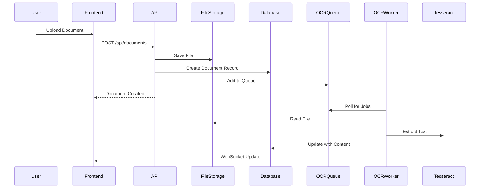
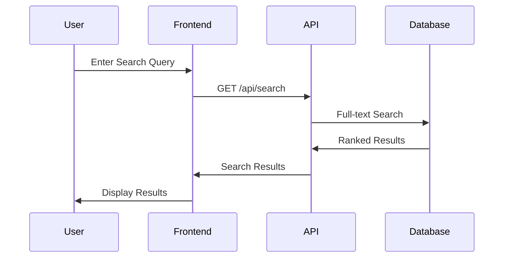

# Architecture Overview

This document provides a comprehensive overview of Readur's architecture, design decisions, and technical implementation details.

## Table of Contents

- [System Architecture](#system-architecture)
- [Technology Stack](#technology-stack)
- [Component Overview](#component-overview)
  - [Backend (Rust/Axum)](#backend-rustaxum)
  - [Frontend (React)](#frontend-react)
  - [Database (PostgreSQL)](#database-postgresql)
  - [OCR Engine](#ocr-engine)
- [Data Flow](#data-flow)
- [Security Architecture](#security-architecture)
- [Performance Considerations](#performance-considerations)
- [Scalability](#scalability)
- [Design Patterns](#design-patterns)

## System Architecture

```
┌─────────────────┐    ┌─────────────────┐    ┌─────────────────┐
│   React Frontend │────│   Rust Backend  │────│  PostgreSQL DB  │
│   (Port 8000)   │    │   (Axum API)    │    │   (Port 5433)   │
└─────────────────┘    └─────────────────┘    └─────────────────┘
         │                       │                       │
         │              ┌─────────────────┐             │
         └──────────────│  File Storage   │─────────────┘
                        │  + OCR Engine   │
                        └─────────────────┘
```

### High-Level Components

1. **Web Interface**: Modern React SPA with Material-UI
2. **API Server**: High-performance Rust backend using Axum
3. **Database**: PostgreSQL with full-text search capabilities
4. **File Storage**: Local or network-mounted filesystem
5. **OCR Processing**: Tesseract integration for text extraction
6. **Background Jobs**: Async task processing for OCR and file watching

## Technology Stack

### Backend
- **Language**: Rust (for performance and memory safety)
- **Web Framework**: Axum (async, fast, type-safe)
- **Database ORM**: SQLx (compile-time checked queries)
- **Authentication**: JWT tokens with bcrypt password hashing
- **Async Runtime**: Tokio
- **Serialization**: Serde

### Frontend
- **Framework**: React 18 with TypeScript
- **UI Library**: Material-UI (MUI)
- **State Management**: React Context + Hooks
- **Build Tool**: Vite
- **HTTP Client**: Axios
- **Routing**: React Router

### Infrastructure
- **Database**: PostgreSQL 14+ with pgvector extension
- **OCR**: Tesseract 4.0+
- **Container**: Docker with multi-stage builds
- **Reverse Proxy**: Nginx/Traefik compatible

## Component Overview

### Backend (Rust/Axum)

The backend is structured following clean architecture principles:

```
src/
├── main.rs              # Application entry and server setup
├── config.rs            # Configuration management
├── models.rs            # Domain models and DTOs
├── error.rs             # Error handling
├── auth.rs              # Authentication middleware
├── routes/              # HTTP route handlers
│   ├── auth.rs         # Authentication endpoints
│   ├── documents.rs    # Document CRUD operations
│   ├── search.rs       # Search functionality
│   └── ...
├── db/                  # Database operations
│   ├── documents.rs    # Document queries
│   ├── users.rs        # User queries
│   └── ...
├── services/            # Business logic
│   ├── ocr.rs          # OCR processing
│   ├── file_service.rs # File management
│   └── watcher.rs      # Folder watching
└── tests/              # Integration tests
```

Key design decisions:
- **Async-first**: All I/O operations are async
- **Type safety**: Leverages Rust's type system
- **Error handling**: Comprehensive error types
- **Dependency injection**: Clean separation of concerns

### Frontend (React)

The frontend follows a component-based architecture:

```
frontend/src/
├── components/          # Reusable UI components
│   ├── DocumentList/
│   ├── SearchBar/
│   └── ...
├── pages/              # Page-level components
│   ├── Dashboard/
│   ├── Documents/
│   └── ...
├── services/           # API integration
│   ├── api.ts         # Base API client
│   ├── auth.ts        # Auth service
│   └── documents.ts   # Document service
├── hooks/              # Custom React hooks
├── contexts/           # React contexts
└── utils/              # Utility functions
```

### Database (PostgreSQL)

Schema design optimized for document management:

```sql
-- Core tables
users                   # User accounts
documents              # Document metadata
document_content       # Extracted text content
document_tags          # Many-to-many tags
sources                # File sources (folders, S3, etc.)
ocr_queue              # OCR processing queue

-- Search optimization
document_search_index  # Full-text search index
```

Key features:
- **Full-text search**: PostgreSQL's powerful search capabilities
- **JSONB fields**: Flexible metadata storage
- **Triggers**: Automatic search index updates
- **Views**: Optimized query patterns

### OCR Engine

OCR processing pipeline:

1. **File Detection**: New files detected via upload or folder watch
2. **Queue Management**: Files added to processing queue
3. **Pre-processing**: Image enhancement and optimization
4. **Text Extraction**: Tesseract OCR with language detection
5. **Post-processing**: Text cleaning and formatting
6. **Database Storage**: Indexed for search

## Data Flow

### Document Upload Flow



### Search Flow



## Security Architecture

### Authentication & Authorization

- **JWT Tokens**: Stateless authentication
- **Role-Based Access**: Admin, User roles
- **Token Refresh**: Automatic token renewal
- **Password Security**: Bcrypt with salt rounds

### API Security

- **CORS**: Configurable allowed origins
- **Rate Limiting**: Prevent abuse
- **Input Validation**: Comprehensive validation
- **SQL Injection**: Parameterized queries via SQLx

### File Security

- **Upload Validation**: File type and size checks
- **Virus Scanning**: Optional ClamAV integration
- **Access Control**: Document-level permissions
- **Secure Storage**: Filesystem permissions

## Performance Considerations

### Backend Optimization

- **Connection Pooling**: Database connection reuse
- **Async I/O**: Non-blocking operations
- **Caching**: In-memory caching for hot data
- **Query Optimization**: Indexed searches

### Frontend Optimization

- **Code Splitting**: Lazy loading of routes
- **Virtual Scrolling**: Large document lists
- **Memoization**: Prevent unnecessary re-renders
- **Service Workers**: Offline capability

### OCR Optimization

- **Parallel Processing**: Multiple concurrent jobs
- **Image Pre-processing**: Enhance OCR accuracy
- **Resource Limits**: Memory and CPU constraints
- **Queue Priority**: Smart job scheduling

## Scalability

### Horizontal Scaling

```yaml
# Multiple backend instances
backend-1:
  image: readur:latest
  environment:
    - INSTANCE_ID=1

backend-2:
  image: readur:latest
  environment:
    - INSTANCE_ID=2

# Load balancer
nginx:
  upstream backend {
    server backend-1:8000;
    server backend-2:8000;
  }
```

### Database Scaling

- **Read Replicas**: Distribute read load
- **Connection Pooling**: PgBouncer
- **Partitioning**: Time-based partitions
- **Archival**: Move old documents

### Storage Scaling

- **S3 Compatible**: Object storage support
- **CDN Integration**: Static file delivery
- **Distributed Storage**: GlusterFS/Ceph
- **Archive Tiering**: Hot/cold storage

## Design Patterns

### Backend Patterns

1. **Repository Pattern**: Database abstraction
2. **Service Layer**: Business logic separation
3. **Middleware Chain**: Request processing
4. **Error Boundaries**: Graceful error handling

### Frontend Patterns

1. **Container/Presenter**: Component separation
2. **Custom Hooks**: Logic reuse
3. **Context Provider**: State management
4. **HOCs**: Cross-cutting concerns

### Database Patterns

1. **Soft Deletes**: Data preservation
2. **Audit Trails**: Change tracking
3. **Materialized Views**: Performance
4. **Event Sourcing**: Optional audit log

## Future Architecture Considerations

### Microservices Migration

Potential service boundaries:
- Authentication Service
- Document Service
- OCR Service
- Search Service
- Notification Service

### Event-Driven Architecture

- Message Queue (RabbitMQ/Kafka)
- Event Sourcing
- CQRS Pattern
- Async communication

### Cloud-Native Features

- Kubernetes deployment
- Service mesh (Istio)
- Distributed tracing
- Cloud storage integration

## Monitoring and Observability

### Metrics

- Prometheus metrics endpoint
- Custom business metrics
- Performance counters
- Resource utilization

### Logging

- Structured logging (JSON)
- Log aggregation ready
- Correlation IDs
- Debug levels

### Tracing

- OpenTelemetry support
- Distributed tracing
- Performance profiling
- Request tracking

## Next Steps

- Review [deployment options](deployment.md)
- Explore [performance tuning](OCR_OPTIMIZATION_GUIDE.md)
- Understand [database design](DATABASE_GUARDRAILS.md)
- Learn about [testing strategy](TESTING.md)